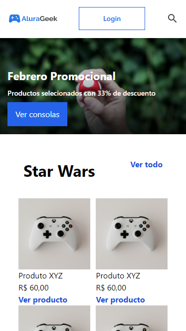
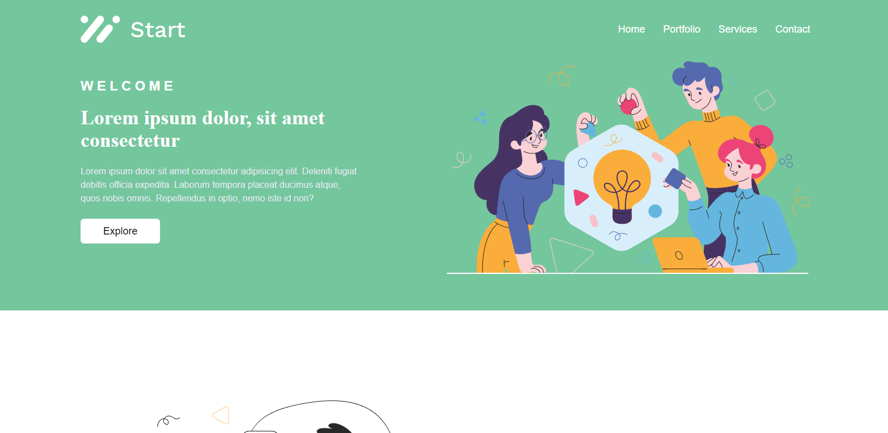
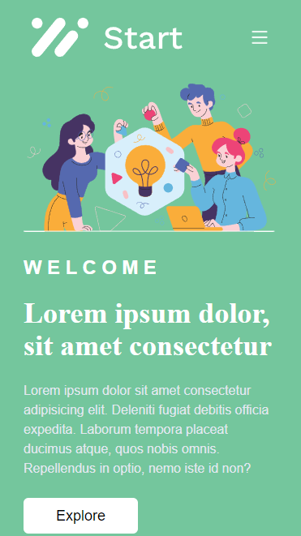

# frontend-projects

Welcome to the repository for my frontend-only college projects.

## Featured Projects
### **static-pages/alura-geek**

    

    

### **static-pages/start**

    

    

### **dynamic-pages/app_filmes**

    

### **dynamic-pages/revenda**

    

## Folder Structure

- **dynamic-pages/**  
  Contains various React applications made in class.

- **media/**  
  Contains images used in various README files.

- **static-pages/**  
  Contains various static pages made in class.
