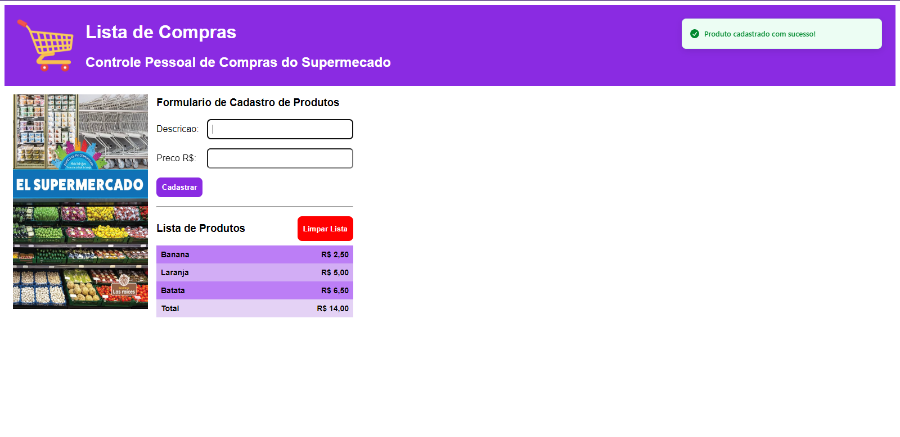

# dynamic-pages

Welcome to the directory containing various React applications made in class. Each folder includes a specific application designed to meet different needs. Below is a brief overview of each folder:

## Directory Structure

```
/dynamic-pages
│
├── app_filmes
│   └── React application for managing and tracking movies.
│
├── compras
│   └── React application for making a shopping list.
│
├── imobiliaria
│   └── React application for a real estate agency to help pre-register potential tenants.
│
└── revenda
    └── React application for a car dealership's promotional event.
```

## Projects by directory

### 1. `app_filmes`
<div>
    
</div>

### 2. `compras`
<div>
    
</div>

### 3. `imobiliaria`
<div>
    
</div>

### 4. `revenda`
<div>
    
</div>
