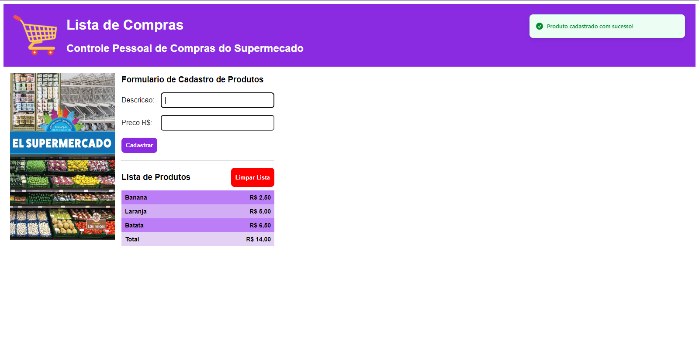

# Compras
<div>
    
</div>

## Description

"Compras" is a React application designed for personal supermarket shopping management. Users can register products along with their prices, view the total cost of their shopping list, and clear the list when needed.

## Technologies Used

- React
- react-hook-form
- sonner (for notifications)
- CSS

## Installation

1. Clone the repository:
   ```bash
   git clone https://github.com/bgbaine/frontend-projects.git
   ```

2. Navigate to the project directory:
   ```bash
   cd frontend-projects/dynamic-pages/compras
   ```

3. Install the dependencies:
   ```bash
   npm install
   ```

4. Start the development server:
   ```bash
   npm start
   ```

## Features

- **Add Products**: Register new products by filling out a form with the product description and price.
- **View Shopping List**: See all registered products along with their prices and the total cost.
- **Clear List**: Remove all products from the shopping list with a confirmation prompt.

## Usage

1. Open the app to see the form for adding products.
2. Fill in the product description and price, then click "Register."
3. The registered products will be displayed in a list along with the total cost.
4. To clear the list, click the "Clear List" button.