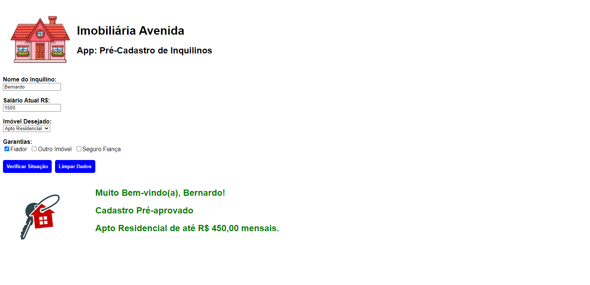

# Imobiliaria
<div>
    
</div>

## Description

"Imobiliaria" is a React application designed for a real estate agency to help pre-register potential tenants. Users can enter their name, current salary, desired property, and guarantee options to check their pre-registration status.

## Technologies Used

- React
- react-hook-form
- CSS

## Installation

1. Clone the repository:
   ```bash
   git clone https://github.com/bgbaine/frontend-projects.git
   ```

2. Navigate to the project directory:
   ```bash
   cd frontend-projects/dynamic-pages/imobiliaria
   ```

3. Install the dependencies:
   ```bash
   npm install
   ```

4. Start the development server:
   ```bash
   npm start
   ```

## Features

- **Input Fields**: Users can enter their name, salary, and select the desired property type.
- **Guarantee Options**: Users can choose various guarantee options such as "Fiador," "Outro Imóvel," or "Seguro Fiança."
- **Pre-Registration Verification**: The app verifies if the provided data meets the criteria and displays a corresponding message along with an image indicating the registration status.
- **Clear Form**: Users can reset the form and clear the displayed messages.

## Usage

1. Open the app to see the pre-registration form.
2. Fill in the tenant's name, current salary, and select a desired property.
3. Check the desired guarantee options and click "Verify Status."
4. The app will display the result with a message and image based on the input.
5. Click "Clear Data" to reset the form and messages.