# static-pages

Welcome to the directory containing various static pages created in class. Each folder includes a specific application designed to meet different needs. Below is a brief overview of each folder:

## Projects by Directory

### 1. `responsive`

#### a. `alura-geek`
<div>
    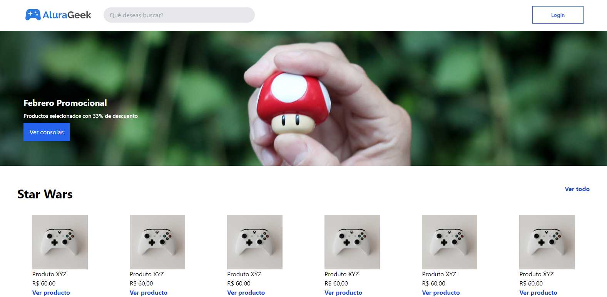
</div>
<div style="display: flex; justify-content: center">
    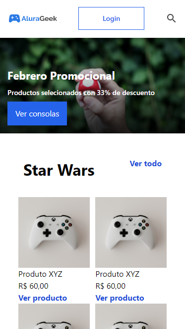
</div>

#### b. `digital-agency`
<div>
    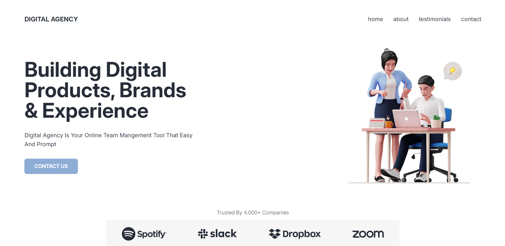
</div>
<div style="display: flex; justify-content: center">
    
</div>

#### c. `start`
<div>
    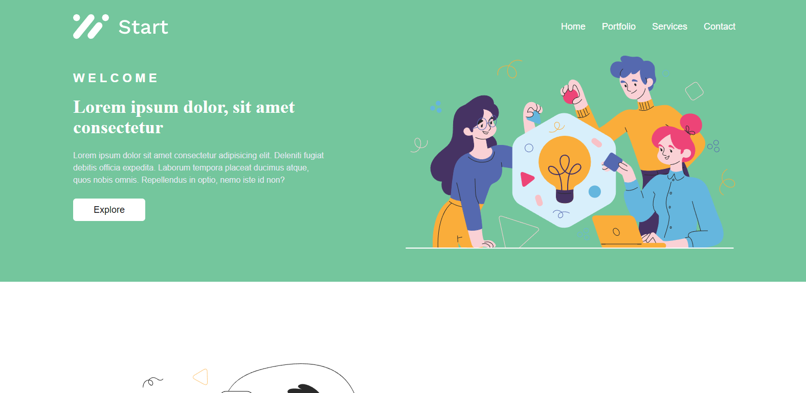
</div>
<div style="display: flex; justify-content: center">
    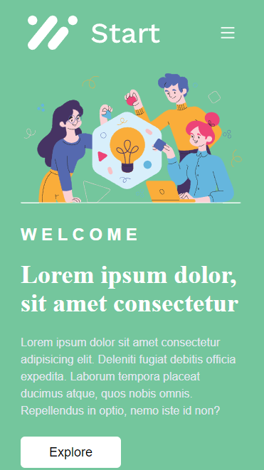
</div>

#### d. `sweetdeli`
<div>
    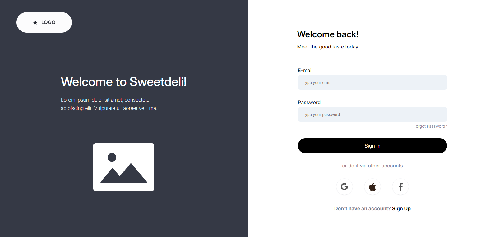
</div>
<div style="display: flex; justify-content: center">
    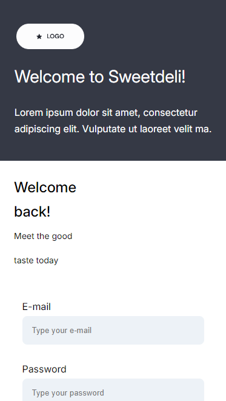
</div>

### 2. `non-responsive`

#### a. `bandage`
<div>
    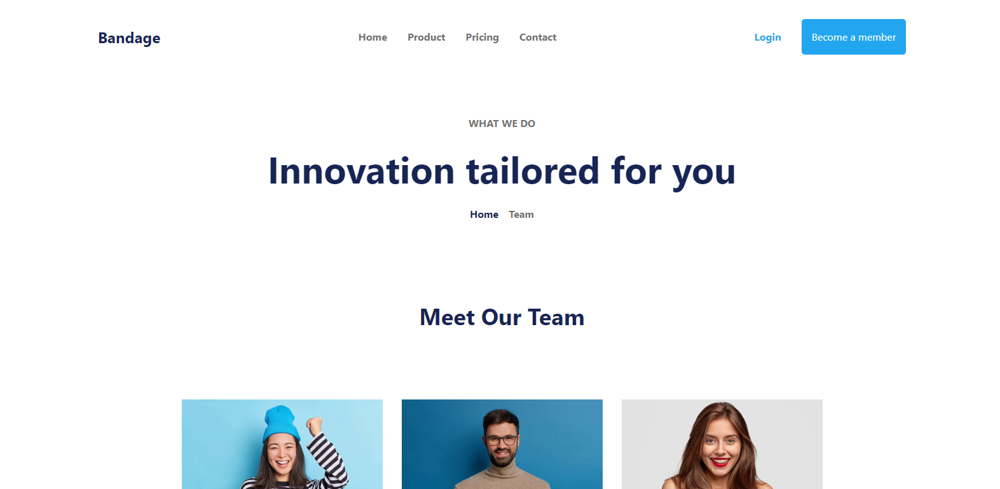
</div>

#### b. `central-world`
<div>
    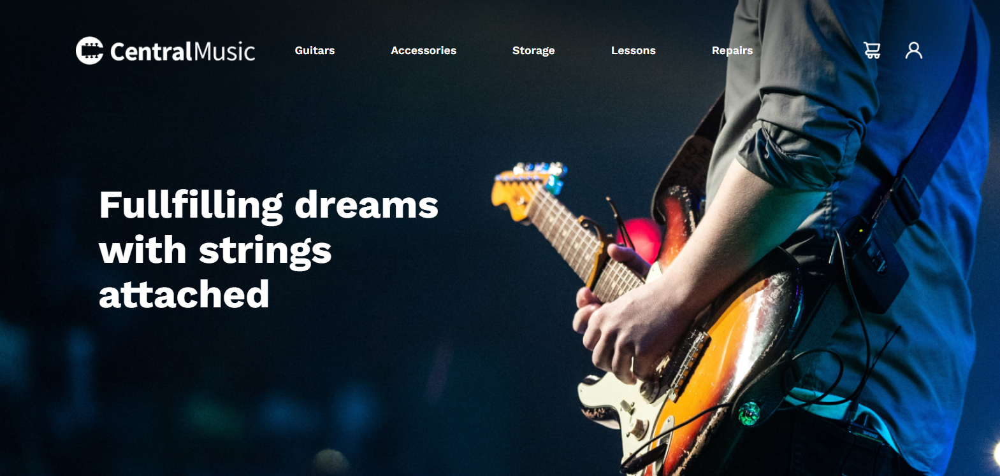
</div>

#### c. `fruta&fruto`
<div>
    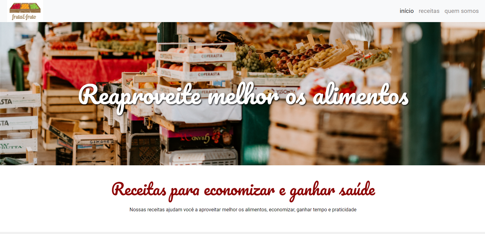
</div>

#### d. `neworld`
<div>
    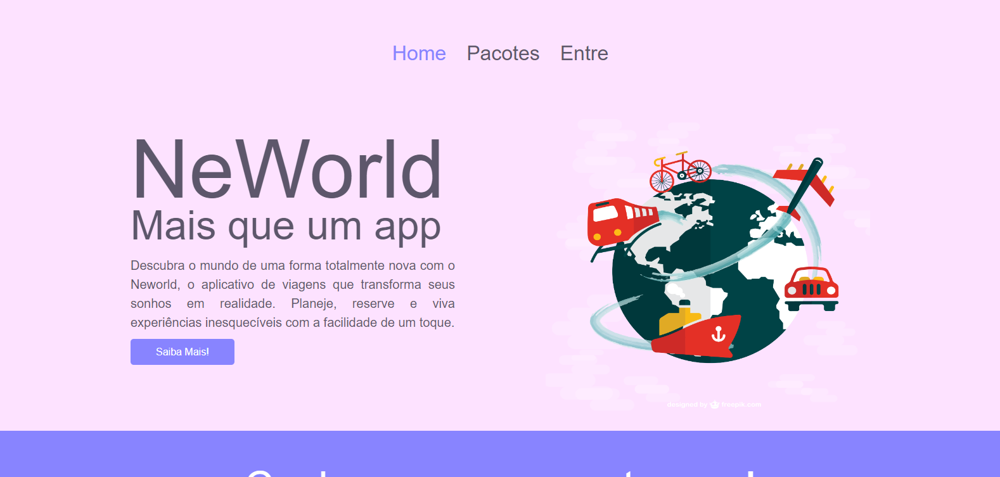
</div>

## Directory Structure

```
/static-pages
│
├── non-responsive
│   ├── bandage
│   │   └── A web page for a fictional company with a sleek header and service sections.
│   │
│   ├── central-world
│   │   └── A music store page featuring new products and popular finds.
│   │
│   ├── fruta&fruto
│   │   └── A site promoting healthy eating with recipes and a welcoming banner.
│   │
│   └── neworld
│       └── A travel app platform for discovering destinations and managing plans.
│
└── responsive
    ├── alura-geek
    │   └── An online store for geek culture with collectibles and organized product listings.
    │
    ├── digital-agency
    │   └── A platform for a marketing agency showcasing services and client testimonials.
    │
    ├── start
    │   └── A modern landing page for a creative agency with sections for services and team.
    │
    └── sweetdeli
        └── A login page with a modern layout and options for email or social media sign-in.
```
