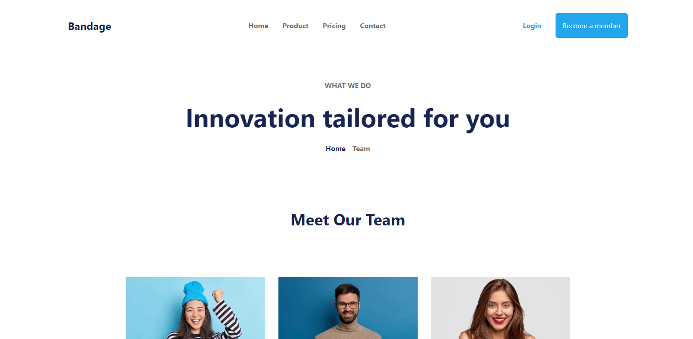

# Bandage
<div>
    
</div>
<div>
    
</div>
<div>
    
</div>

## Description

"Bandage" is a web page designed for a fictional company. It features a sleek header, multiple sections to showcase services and team members, and a footer with company information and a subscription form.

## Technologies Used

- HTML
- CSS (with utility classes from Tailwind CSS)

## Installation

1. Clone the repository:
   ```bash
   git clone https://github.com/bgbaine/frontend-projects.git
   ```

2. Navigate to the project directory:
   ```bash
   cd frontend-projects/static-pages/non-responsive/bandage/src
   ```

3. Open `index.html` in your browser to view the site.

## Features

- **Header Navigation**: Includes links to Home, Product, Pricing, and Contact pages, along with login and membership options.
- **What We Do Section**: Highlights the company's mission with engaging text.
- **Meet Our Team**: Displays team members with images, names, professions, and social media links.
- **Free Trial Section**: Encourages visitors to try the service with a prominent call-to-action button.
- **Footer**: Contains company information, legal links, features, resources, and a subscription form.