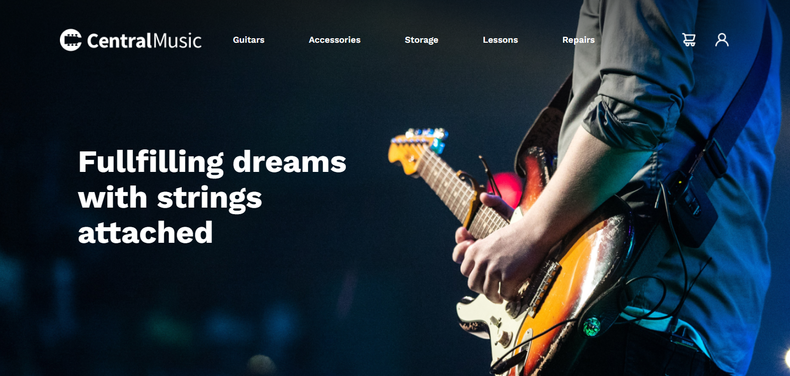

# CentralMusic
<div>
    
</div>
<div>
    
</div>
<div>
    
</div>

## Description

"CentralMusic" is a web page designed for a music store. It features a striking header, sections for new products and popular finds, and a footer with account information and social media links.

## Technologies Used

- HTML
- CSS (with utility classes from Tailwind CSS)

## Installation

1. Clone the repository:
   ```bash
   git clone https://github.com/bgbaine/frontend-projects.git
   ```

2. Open the project directory in Visual Studio Code:
   ```bash
   code frontend-projects/static-pages/non-responsive/central-world/
   ```

3. Start a Live Server (download the extension if you do not have it yet).

## Features

- **Header Navigation**: Includes links to various product categories (Guitars, Accessories, Storage, Lessons, Repairs) along with icons for cart and profile.
- **Main Header**: Captivating tagline that highlights the store's mission.
- **New Products Section**: Displays newly available products with images, brand names, prices, and descriptions.
- **Popular Finds Section**: Showcases popular items in a visually appealing layout.
- **Footer**: Contains account information, store details, and social media links.