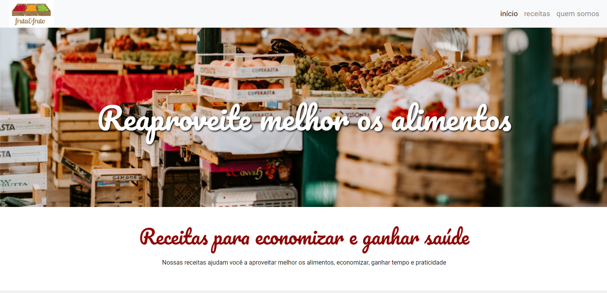

# Fruta&Fruto
<div>
    
</div>
<div>
    
</div>

## Description

"Fruta&Fruto" is a website designed to promote healthy eating by reusing food ingredients. It features a clean layout with sections for recipes and a welcoming banner, aimed at encouraging users to make healthier choices with their meals.

## Technologies Used

- HTML
- CSS (with external stylesheets for reset, main styles, and responsive design)

## Installation

1. Clone the repository:
   ```bash
   git clone https://github.com/bgbaine/frontend-projects.git
   ```

2. Navigate to the project directory:
   ```bash
   cd frontend-projects/static-pages/non-responsive/fruta&fruto/src
   ```

3. Open `index.html` in your browser to view the site.

## Features

- **Header Navigation**: Simple navigation menu with links to the homepage, recipes, and an "About Us" section.
- **Main Banner**: Eye-catching title encouraging users to make better use of food.
- **Recipe Section**: Displays various recipes in card format, including images, titles, descriptions, and buttons to view the full recipe.
- **Responsive Design**: Styled for optimal viewing on different devices.