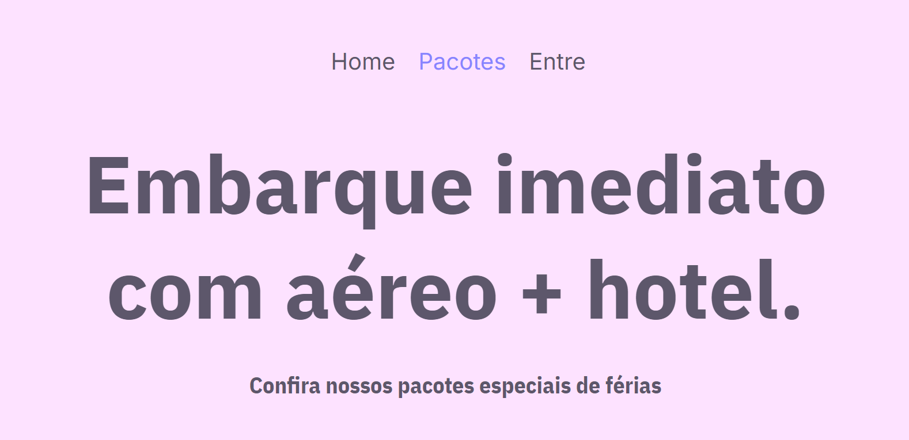
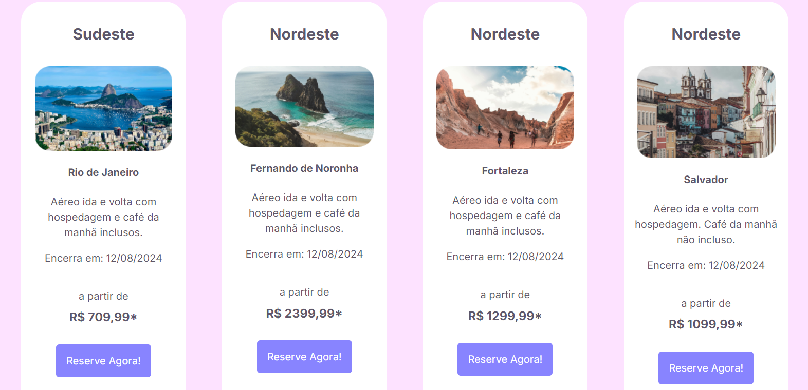

# NeWorld Website
<div>
    
</div>
<div>
    
</div>
<div>
    
</div>
<div>
    
</div>

## Description

"NeWorld" is a website designed as a travel application platform that offers users a comprehensive way to discover new destinations and manage their travel plans. It highlights the app's features and benefits, encouraging users to engage and explore further.

## Technologies Used

- HTML
- CSS (linked external stylesheet)

## Installation

1. Clone the repository:
   ```bash
   git clone https://github.com/bgbaine/frontend-projects.git
   ```

2. Navigate to the project directory:
   ```bash
   cd frontend-projects/static-pages/non-responsive/neworld-home/src
   ```

3. Open `index.html` in your browser to view the site.

## Features

- **Header Navigation**: Provides links to the homepage, packages, and login page for easy navigation.
- **Main Content**: Introduces the app with an engaging title and description, along with a call-to-action button.
- **Advantages Section**: Highlights key benefits of using the NeWorld app.
- **Feature Cards**: Describes various features of the app, including triage, planning, execution, and post-trip feedback.
- **Footer Section**: Contains links to company information, legal details, app features, download options, and a newsletter signup form.