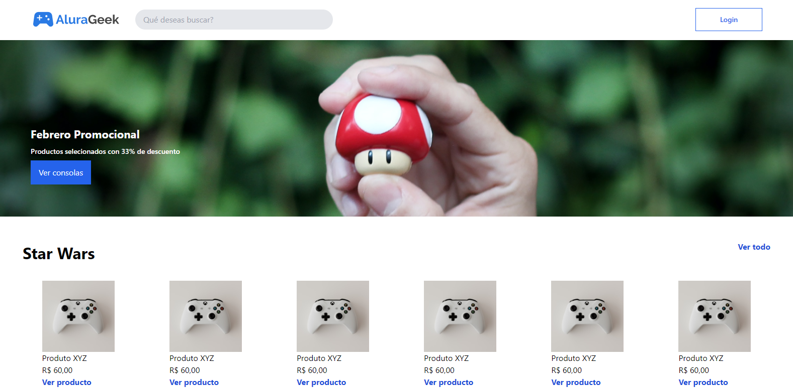

# Alura-Geek
<div>
    
</div>
<div style='display: flex; justify-content: center'>
    
</div>

## Description

"Alura-Geek" is an online store dedicated to geek culture, offering a range of products including collectibles, toys, and merchandise from popular franchises like Star Wars. The site features promotional offers and organized product listings for easy browsing.

## Technologies Used

- HTML
- CSS (linked external stylesheet)

## Installation

1. Clone the repository:
   ```bash
   git clone https://github.com/bgbaine/frontend-projects.git
   ```

2. Navigate to the project directory:
   ```bash
   cd frontend-projects/static-pages/responsive/alura-geek/src
   ```

3. Open `index.html` in your browser to view the site.

## Features

- **Header Navigation**: Includes the store logo, a search bar, and a login button for user access.
- **Promotional Banner**: Highlights special offers with a call-to-action button to view products.
- **Product Sections**: Displays multiple sections for different product categories, each with a title, a link to view all products, and a grid layout for individual items.
- **Product Cards**: Each product card includes an image, product name, price, and a link to view more details.