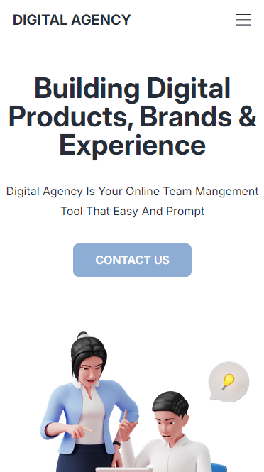

# Digital Agency Website
<div>
    
</div>
<div style='display: flex; justify-content: center'>
    
</div>

## Description

"Digital Agency" website serves as a platform for a digital marketing and product development agency. It showcases the agency's services, client testimonials, and contact information, aiming to attract potential clients and partners.

## Technologies Used

- HTML
- CSS (linked external stylesheets)

## Installation

1. Clone the repository:
   ```bash
   git clone https://github.com/bgbaine/frontend-projects.git
   ```

2. Navigate to the project directory:
   ```bash
   cd frontend-projects/static-pages/responsive/digital-agency/src
   ```

3. Open `index.html` in your browser to view the site.

## Features

- **Header Navigation**: Includes the agency's title, navigation links for home, about, testimonials, and contact.
- **Hero Section**: Features a welcoming message, a brief description, and a call-to-action button.
- **Client Logos**: Displays logos of companies that trust the agency, highlighting credibility.
- **Service Sections**: Dedicated areas for Branding & Design and Custom & Plugin Development, each with images and descriptions.
- **Testimonials**: Features client testimonials to build trust and showcase satisfaction.
- **Contact Section**: Encourages potential clients to get in touch, along with a relevant image.
- **Footer**: Contains links to resources, company information, and social media profiles, along with copyright information.