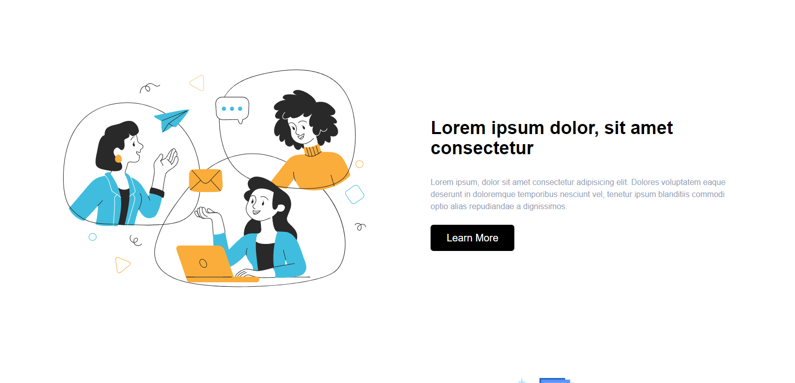
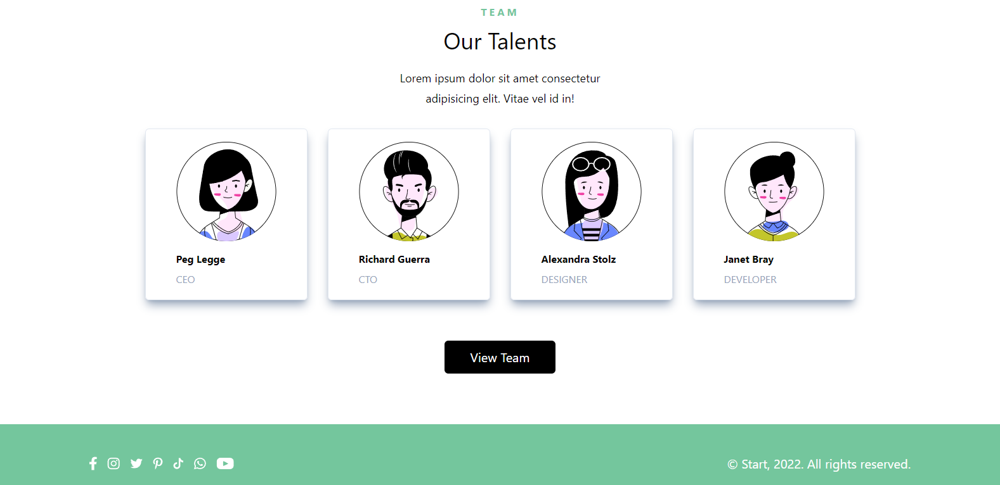
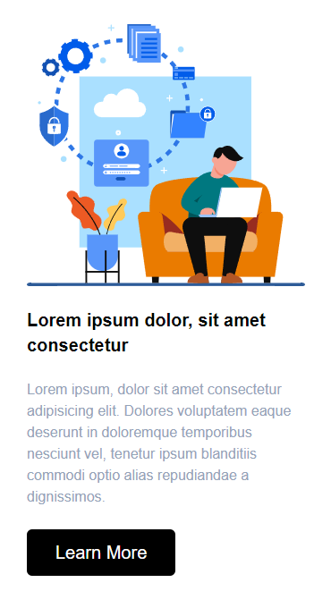
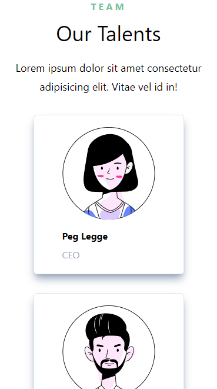

# Start Website
<div>
    
</div>
<div style='display: flex; justify-content: center'>
    
</div>
<div style='display: flex; justify-content: center'>
    
</div>
<div style='display: flex; justify-content: center'>
    
</div>
<div style='display: flex; justify-content: center'>
    
</div>
<div style='display: flex; justify-content: center'>
    
</div>

## Description

"Start" website is a modern landing page designed for showcasing a creative agency or startup. It features an appealing layout with sections for an introduction, services, team members, and contact information.

## Technologies Used

- HTML
- CSS (linked external stylesheet)

## Installation

1. Clone the repository:
   ```bash
   git clone https://github.com/bgbaine/frontend-projects.git
   ```

2. Navigate to the project directory:
   ```bash
   cd frontend-projects/static-pages/responsive/start/src
   ```

3. Open `index.html` in your browser to view the site.

## Features

- **Header Navigation**: Includes the agency's logo and navigation links (Home, Portfolio, Services, Contact).
- **Welcome Section**: Engaging introduction with a welcoming message, description, and an "Explore" button.
- **Services Sections**: Details about the agency's offerings, each with accompanying images and "Learn More" buttons.
- **Team Section**: Showcases team members with images, names, and titles, along with a button to view the full team.
- **Footer**: Contains social media icons and copyright information.